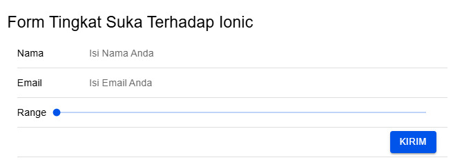

Cara Menambahkan Komponen Di Halaman Ionic

1.  Pada folder tugas buka folder src/app/home/home.page.html.
2.  Menentukan apa saja komponen yang ingin ditambahkan dalam halaman ionic. Untuk template halaman yang disediakan dalam Ionic dapat diakses melalui https://ionicframework.com/docs/components.
3.  Menambahkan komponen menu dengan menggunakan tag ion-menu. 
4.  Menambahkan halaman menu yang diperlukan misalnya Home, Profil, Galeri, Berita, dan Kontak. Bentuk menu dapat dilihat pada gambar .
5.  Buat list dari menu tersebut mangggunakan tag ion-list dengan masing-masing ion-item memiliki routerLink sebagai alamat dari halaman yang dituju dan routerDirection="root" agar halaman dapat langsung menuju pada halaman-halaman tersebut.
6.  Pada action bar dapat menambahkan pencarian dengan menggunakan tag ion-searchbar. Sesuaikan ukuran dan warna pencarian yang diinginkan. Agar pencarian dapat sejajar di sebelah kanan gunakan tag ion-buttons slot="end". Bentuk pencarian dapat dilihat pada gambar .
7.  Menambahkan konten utama di halaman ionic dengan menggunakan tag ion-content.
8.  Menambahkan list pada konten utama dengan menggunakan tag ion-list yang berisi data diri dengan kumpulan ion-item untuk ion-avatar sebagai avatar dari user dan ion-label untuk peletakan kalimat. Bentuk pencarian dapat dilihat pada gambar .
9.  Menambahkan card di dalam konten utama dengan menggunakan tag ion-card. Di dalam card terdapat gambar logo ionic yang menggunakan tag ionic, ion-card-title sebagai judul dari card, dan ion-card-subtitle sebagai kalimat yang digunakan sebagai penjelasan. Bentuk card dapat dilihat pada gambar .
10.  Menambahkan form pada konten utama dengan menggunakan tag form.
11. Di dalam form terdapat kumpulan ion-item yang berisi input, range, dan button.
12. Menambahkan ion-input sebagai input yang digunakan untuk mengisikan nama dan email.
13. Menambahkan ion-range sebagai range yang digunakan untuk mengukur tingkat kesukaan terhadap ionic.
14. Menambahkan ion-button sebagai tombol yang digunakan untuk mengirimkan form.
15. Bentuk form dapat dilihat pada gambar .
16. Menambahkan tabel menggunakan tag ion-grid.
17. Menggunakan tag ion-row untuk membuat baris baru pada tabel dengan tag ion-col yang berada dalam tag ion-row sehingga membentuk kolom.
18. Sesuaikan jumlah baris dan kolom sesuai kebutuhan.
19. Bentuk tabel dapat dilihat pada gambar .
20. Menambahkan footer dengan menggunakan tag ion-footer dengan isi footer ada pada tag ion-title.
21. Bentuk footer dapat dilihat pada gambar . 